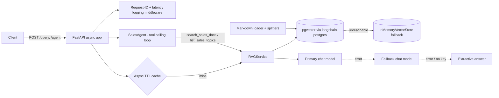

# Architecture

## Overview

## Components

| Module | Responsibility |
| --- | --- |
| `app/ingest.py` | Parses front matter, splits markdown by headers then by size, attaches `source`, `title`, `section`, `url` (GitHub link with section anchor) and a deterministic chunk `id`. |
| `app/vectorstore.py` | Builds a `PGVector` store in async mode (or in-memory), indexes with deterministic ids (re-ingest = upsert), normalizes scores so higher = more relevant. |
| `app/embeddings.py` | OpenAI embeddings when a key is present, otherwise deterministic hashing embeddings for offline dev/CI. |
| `app/llm.py` | `LLMProvider`: primary model with `with_fallbacks([fallback])`, for both plain chat and tool-bound chat. |
| `app/prompts.py` | Grounding prompts: answer only from context, cite `[n]` / `[S n]`, fixed abstention string. |
| `app/rag.py` | Retrieve, generate, cache. Degrades to extractive answers when the LLM is unavailable or fails. Degraded answers are never cached. |
| `app/agent.py` | Minimal tool-calling loop built on `bind_tools`. Per-request tool session so concurrent requests never share citation ids. Step limit + fallback to single-shot RAG. |
| `app/main.py` | FastAPI app factory, lifespan startup (ingest + index), endpoints, structured logging middleware. |
| `evaluation/` | Ground truth set, deterministic metrics, LLM-as-judge, human review CSV workflow. |

## Request lifecycle (`POST /query`)

1. Middleware assigns/propagates `x-request-id` and stores it in a context var so every log line for the request carries it.
2. Cache lookup keyed on normalized question + `top_k`.
3. Vector search returns `(Document, relevance)` pairs; results under `MIN_RELEVANCE` are dropped.
4. If nothing relevant, return the abstention string without calling the LLM.
5. Otherwise build a numbered context block and call the LLM chain (`prompt | model.with_fallbacks | StrOutputParser`).
6. Response includes the answer, `sources` (title, section, deep link, score, snippet), `mode`, and latency.

## Agent (`POST /agent`)

The agent receives two tools:

- `search_sales_docs(query, k)` returns passages labelled `[S1]`, `[S2]`, ... (labels are stable within a request even if a passage is retrieved twice).
- `list_sales_topics()` returns the indexed document titles.

The loop runs up to `AGENT_MAX_STEPS` model turns. If the model keeps calling tools, it is asked for a final answer. Any exception falls back to single-shot RAG, so the endpoint always returns something useful.

## Resilience summary

| Failure | Behavior |
| --- | --- |
| Postgres / pgvector unreachable at startup | Log exception, serve from in-memory store. |
| No `OPENAI_API_KEY` | Hashing embeddings + extractive answers. |
| Primary model error / timeout | LangChain `with_fallbacks` to the secondary model (with retries via `max_retries`). |
| Both models fail | Extractive answer, `mode="extractive"`, not cached. |
| Agent loop error | Falls back to `/query` behavior. |

## Scaling notes

- The in-process cache is per worker; swap `AsyncTTLCache` for Redis when running many replicas.
- `PGVector` does not create a vector index by default (exact search); for large corpora add an HNSW or IVFFlat index on the embedding column.
- Ingestion runs at startup for convenience; for production, run `/ingest` (or a job) on document changes instead.
